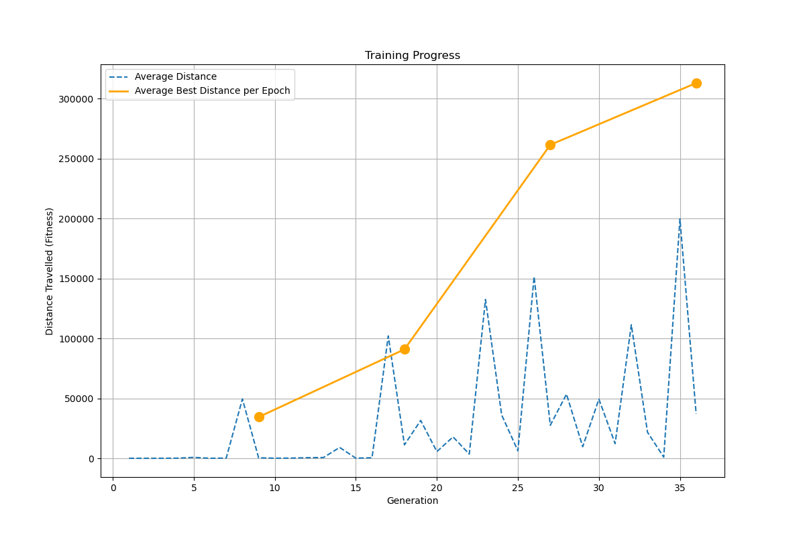
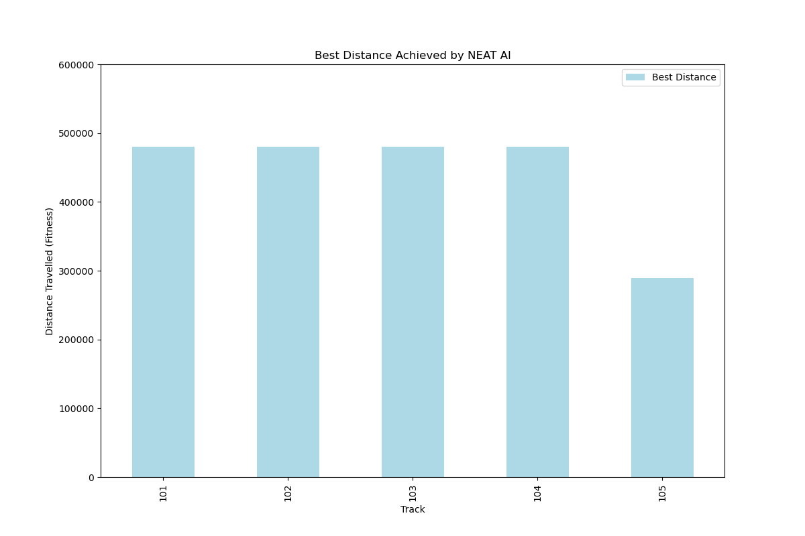
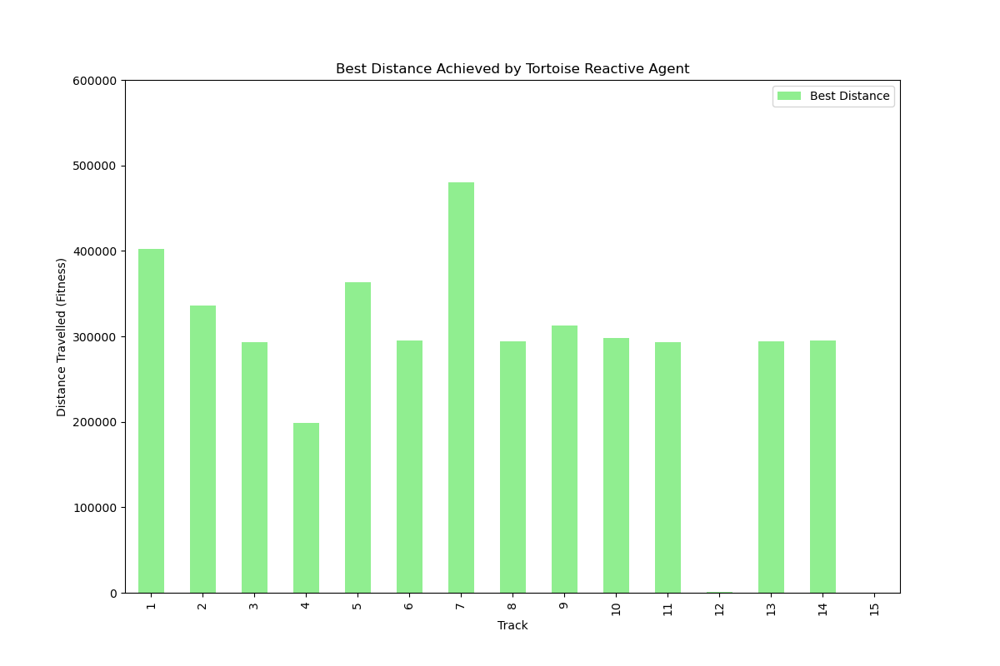
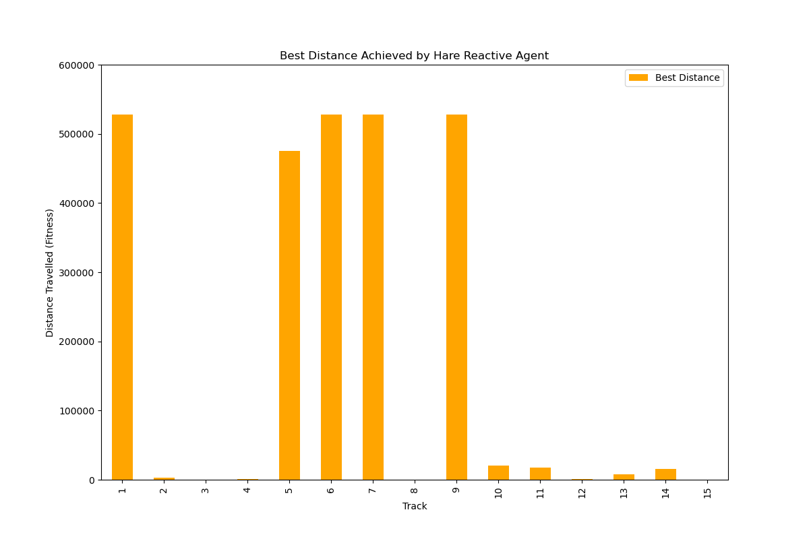
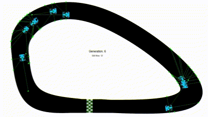

# Generalised-NEAT-Racing

Generalised-NEAT-Racing is a Python-based simulation project that explores the ability of NEAT (NeuroEvolution of Augmenting Topologies) agents to generalise their performance on unseen tracks. The project combines artificial intelligence, genetic algorithms, and data visualisation to study adaptive behavior and learning.

---

## Features

- **NEAT Agents**: AI agents that learn to navigate racing tracks.
- **Reactive Agents**: Pre-programmed agents with survival and performance-based decision-making strategies.
- **Unseen Track Generalisation**: Evaluate the performance of agents on tracks not seen during training.
- **Configurable Environment**: Easily adjustable parameters such as number of epochs, training/testing splits, and shuffle modes.
- **Data Visualisation**: Analyse agent performance through graphs of training progress and testing results.
- **GUI for Configuration**: A user-friendly menu to configure settings and run different simulations.

---

## Project Structure

```
Generalised-NEAT-Racing/
├── assets/               # Contains car sprite and track images
├── config/               # Config files for NEAT and settings
├── data/                 # CSV files storing simulation results
├── src/                  # Source code
├── README.md             # Project documentation
```

---

## Installation

1. Clone this repository:
   ```bash
   https://github.com/yourusername/Generalised-NEAT-Racing.git
   ```

2. Install dependencies

---

## Usage

1. Run the main script:

2. Use the GUI to:
   - Start training/testing NEAT agents.
   - Run simulations for reactive agents.
   - Visualise progress and results.
   - Adjust parameters

---

## Examples and Visuals


### **Training Progress**


### **Testing Results**


### **Reactive Agent Results**



### **Simulation GIFs**


---

## Configuration

- Adjust `config/config.txt` for NEAT-specific parameters.

---

## How It Works

1. **NEAT Training**:
   - Agents evolve through neuroevolution to learn optimal navigation strategies.
   - Tracks are split into training and testing sets.

2. **Reactive Agents**:
   - **Tortoise Agent**: Prioritises safety and survival.
   - **Hare Agent**: Focuses on speed and performance.

3. **Generalisation Testing**:
   - Agents are evaluated on unseen tracks to assess their ability to generalise learning.

4. **Visualisation**:
   - Data is stored in CSV files for visualisation using `matplotlib` and `pandas`.

---

## File Credits

- **`car.png`**: Existing asset.
- **`map1.png`, `map2.png`, `map4.png`**: Existing assets.
- **`map3.png`**: Modified by Nadan Liddar.
- **`main.py`**: Modified by Nadan Liddar (originally named `newcar.py`).
- **`config.txt`**: Modified by Nadan Liddar.
- **All other files**: Authored by Nadan Liddar.

---

## Acknowledgements

- Inspired by Cheesy AI and NeuralNine (Florian Dedov).
- Developed and expanded by Nadan Liddar.

---

## Contact

For questions or feedback, please reach out to nliddar@gmail.com
